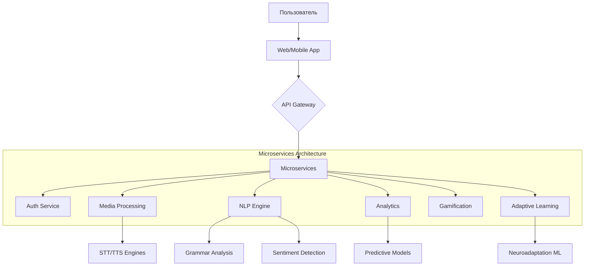
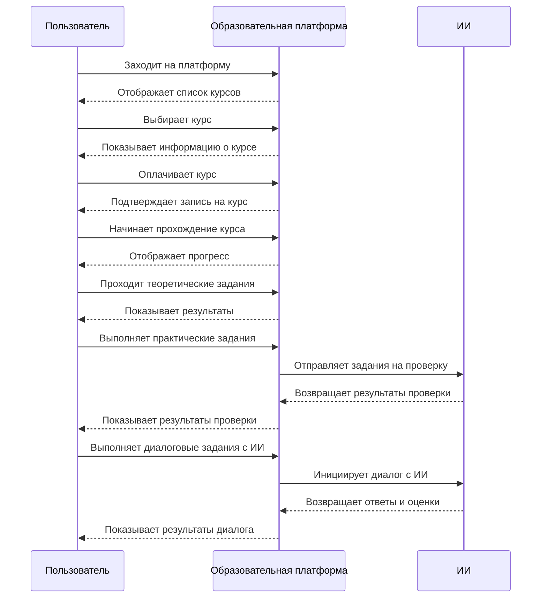
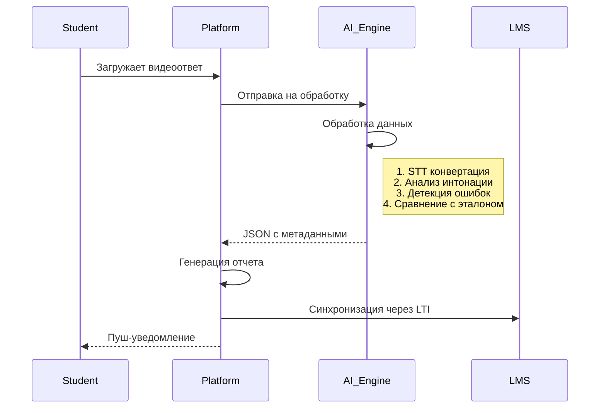

# Концепция образовательной платформы для курсов английского языка с ИИ

## Уникальные фичи платформы

### Для учащихся:

1. **Real-time AI Language Partner**

   - Повтор фраз за носителем
   - Виртуальный собеседник с эмоциональным интеллектом (анализ тона)
   - Адаптивные диалоги с подстройкой под уровень студента
   - Непринужденное общение в соц-сетях в течение дня.
   - Чаты с носителями языка

2. **Contextual Error Analysis**

   - Система выявляет паттерны ошибок (например, путаница между Past Simple/Present Perfect)
   - Автоматическая генерация персональных "дорожных карт" для исправления слабых мест

3. **Immersive Gamification**

   - NFT-бейджи а качестве достижений за выполнение заданий

4. **Neuroadaptive Learning**
   - Динамическое изменение сложности заданий

### Для преподавателей:

1. **AI Content Studio**

   - Генератор заданий с контекстной привязкой к интересам группы (например, IT-лексика для разработчиков)
   - Автоматический подбор материалов из открытых источников (TED Talks, научные статьи)

2. **Holistic Analytics Dashboard**

   - Heatmap типичных ошибок по группе
   - Predictive analytics рисков отставания
   - Auto-recommendations по корректировке программы

3. **Cross-platform Assignment Designer**
   - Drag-and-drop создание мультиформатных заданий (аудио + видео + текст)



## User Experience



## Технологический стек

### Бэкенд:

- **Core:** Python 3.11 + uv (Package Manager)
- **Formatting:**
  - **ruff + flake8 + isort**
  - **pre-commit:**
    - **bandit -** Поиск уязвимостей в Python-коде
    - **trailing-whitespace -** Удаление пробелов в конце строк
    - **check-yaml -** Проверка синтаксиса YAML-файлов
    - **check-merge-conflict -** Поиск конфликтов слияния
    - **detect-private-key -** Обнаружение приватных ключей в коде
    - **debug-statements -** Проверка на отладочные вызовы (e.g., pdb.set_trace())
    - **pyupgrade -** Автоматическое обновление синтаксиса Python (Целевая - 3.11)
    - **autoflake -** Удаление неиспользуемых импортов и переменных
    - **detect-secrets -** Поиск секретов (API-ключи, пароли)
    - **pygrep-hooks -** Проверка обязательных аннотаций типов и некорректных `#noqa` комментариев
    - **check-github-workflows -** Валидация GitHub Actions workflow-файлов
    - **autoflake -**
    - **pre-commit-images -** Оптимизация изображений без потери качества
- **API:**
  - **Основа:** FastAPI + Uvicorn (ASGI-сервер)
  - **DB:** SQLAlchemy ORM + PostgreSQL (asyncpg). TimescaleDB (для временных рядов аналитики)
  - **cache:** redis
  - **Search:** ElasticSearch для контента
  - **Tasks:** celery
  - **Auth:** JWT + OAuth2 – аутентификация/авторизация
  - **Validations:** pydantic
  - **Тесты:** pytest
- **AI/ML:**
  - **TensorFlow/PyTorch** – инференс ML-моделей
  - **Hugging Face Transformers** – NLP-модели (проверка эссе, чат-боты)
  - **ONNX Runtime** – оптимизация инференса
  - **Wav2Vec** - синтез речи в текст
  - **BERT** - определение сложности текста (использование языковых идеом и сложных морфологических конструкций)
  - **Tacotrone 2** - синтез тектса в речь
  - **DeepSeek/Yandex-GPT** - для создания и проверки контекста диалога
- **DevOPS:**
  - **Контейнеризация:**
    - Docker – для сервисов и AI-воркеров
    - Docker Compose – локальное окружение
  - **Оркестрация:**
    - Kubernetes (EKS/GKE) + Istio
    - Prometheus + Grafana для мониторинга
    - Deployments для stateless-сервисов
    - StatefulSets для Redis
    - Horizontal Pod Autoscaler (HPA)
    - Ingress-Nginx + Cert-Manager (TLS)
  - **CI/CD (GitHub Actions | GitLab CI):**
    - Автотесты pytest
    - Автоформатирование ruff
    - Сборка образов + сканирование (Trivy)
    - Canary-деплой в k8s (Flagger)

### Фронтенд:

- **Core:** Vue 3 + TypeScript
- **Pinia:** управление состоянием
- **Vuetify/Quasar:** UI-библиотека компонентов
- **Axios:** HTTP-клиент для API
- **Видео/Аудио:** WebRTC + TensorFlow.js для on-device обработки



## Инновационные бизнес-процессы

1. **Dynamic Rubrics Adjustment**  
   Система автоматически корректирует веса критериев оценки на основе:

   - Уровня группы
   - Статистики предыдущих заданий
   - Целей курса (например, акцент на бизнес-лексику)

2. **Cross-modal Feedback Fusion**  
   Комбинированный анализ:

   ```python
   def generate_feedback(audio, video, text):
       speech_analysis = analyze_pronunciation(audio)
       emotion_score = detect_emotions(video)
       grammar_errors = check_grammar(text)
       return hybrid_feedback_model(speech_analysis, emotion_score, grammar_errors)
   ```

3. **Automated Debate Simulator**  
   Генерация виртуальных оппонентов для:
   - Практики аргументации
   - Отработки специфической лексики
   - Тренировки спонтанной речи

## Интеграция с LMS

- **LTI 1.3** для совместимости с Moodle, OpenEdx
- **xAPI** для трекинга активности
- **SCORM Cloud** для контента
- **Webhooks** для real-time обновлений

# Roadmap реализации

1. **MVP Phase** (3 месяца):

   - Разработка дизайна
   - Ядро обработки текстовых заданий
   - Базовый AI Language Partner
   - Интеграция с 1 LMS

2. **Pilot Release** (6 месяцев):

   - Полный цикл обработки аудио/видео
   - Нейроадаптивная система
   - Пакет аналитики для преподавателей

3. **Full Launch** (12 месяцев):
   - VR-интеграция
   - Enterprise-версия с white-label
   - Marketplace дополнительных модулей

## Технические барьеры

- Вычислительные мощности \
   **Как решить?:** Иметь больше денег.
- Качество и доступность данных \
   **Как решить?:** Создавать свои датасеты.
- Точность моделей \
   **Как решить?:** Постоянное дообучение на разнообразных данных.

## Монетизация

- SaaS-модель с подпиской
- Pay-per-use для корпоративных клиентов
- B2B-лицензии - Продажа платформы вузам и корпорациям для обучения сотрудников.
- Фримиум - Бесплатные базовые уроки + платный доступ к экспертной обратной связи.
- Государственные тендеры - Участие в программах цифрового образования (например, обучение мигрантов).
- Data Insights как услуга для HR-департаментов

# Лицензия

Проект распространяется под лицензией GNU GPL v3. Подробности см. в файле [LICENSE](./LICENSE).
